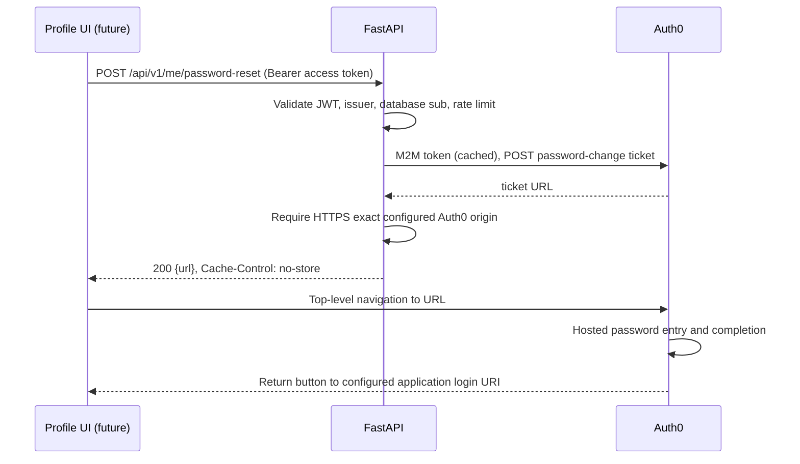

# Auth0 Option A Hosted Password Reset — Backend Implementation + Frontend Implementation Plan

## 1. Title
Auth0 Option A Hosted Password Reset: backend implementation and deferred frontend integration.

## 2. Executive Summary
The profile currently sends an Authentication API reset email directly from the browser. Implement an authenticated backend ticket endpoint; the future UI will navigate to its short-lived Auth0-hosted URL, without an email delivery step. Reuse the existing server M2M client. This is an intentional change from inbox possession to validated application access-token possession as reset authorization.

**Frontend implementation is OUT OF SCOPE for this execution and MUST NOT be performed.**

## 3. Scope
### In Scope — Audit
Frontend, backend, SDK types, tests, configuration and official Auth0 contracts.
### In Scope — Backend Implementation
Authenticated self-service ticket endpoint, issuer binding, server configuration, isolated rate limit, tests.
### In Scope — Documentation/Plan
This file is the sole authoritative plan and only non-backend edit.
### Out of Scope — Frontend Implementation
All frontend source, configuration, dependencies and generated artifacts remain frozen.
### Out of Scope — Live Auth0 Dashboard Changes
No tenant mutation, real reset email, or live ticket generation.

## 4. Current Repository State
- Initial working tree: untracked `backend/bench_ci_tmp.py` and `backend/bench_reversed_tmp.py`; preserve both. Root/backend/frontend `CLAUDE.md` govern service ownership and checks; no tracked AGENTS.md. Backend commands run from `backend/`.
- `frontend/app/pages/profile.vue:63-85`: `sendPasswordResetLink` POSTs email from SDK `user`, SPA client ID and hardcoded `Username-Password-Authentication` to `/dbconnections/change_password`. Loading/success/error refs drive alerts and button. Social users are hidden based on `sub` prefix, which is UI guidance only. Email is not necessarily verified: the same page shows an unverified-email banner.
- `frontend/app/pages/login.vue:28-48`: public `submitForgotPassword` also calls that API with arbitrary entered email and generic completion text. This is a separate recovery use case, not eligible for authenticated tickets.
- `frontend/app/plugins/auth0.client.ts`: createAuth0 uses refresh tokens/localstorage, audience, origin callback. Global fetch interceptor attaches access tokens to all destinations when logged in, not just backend origins. Future ticket navigation must use browser navigation, never authenticated fetch to the ticket. Origin-scoping this interceptor is a separate frontend security follow-up.
- Profile's existing profile update/resend functions explicitly acquire audience-bound access tokens and send Bearer headers to `config.public.api_url`. No central auth API wrapper or reset-password page was found. `/profile` and `/login` already have client-only route rules in `frontend/nuxt.config.ts`.
- Frontend `.env.example` exposes domain, SPA client ID, audience (public identifiers, not secrets). Keep all three for login. SDK types in `frontend/node_modules/@auth0/auth0-vue/dist/typings/interfaces/auth0-vue-client.d.ts` expose `loginWithRedirect`/`getAccessTokenSilently`, no `changePassword` method.
- Installed frontend versions match lock versions: auth0-vue 2.9.0, auth0-spa-js 2.24.1, Nuxt 4.4.8, Vue 3.5.40; backend FastAPI 0.115.14, python-jose 3.5.0, HTTPX 0.28.1, Pydantic 2.13.4, pytest 8.4.2. No new dependencies needed.
- `backend/biosim_server/common/auth/auth0.py`: RS256/JWKS, issuer/audience/expiry validation; frozen principal has validated sub, roles, email and verification flag. Multiple trusted issuers supported, but original principal discarded issuer. Retain validated issuer for this operation to prevent cross-tenant same-sub confusion.
- `backend/biosim_server/users/router.py`: `/api/v1/me` GET/PATCH/DELETE only; PATCH permits name only. No backend reset or resend-verification route exists. Existing UI email/resend mismatch is unrelated and not repaired here.
- `common/auth/auth0_management.py`: server client credentials, Management audience, cached token with lock/expiry margin, HTTPX timeouts and bounded resource retry helper. Ticket creation must not retry automatically after uncertain completion.
- `config.py` uses Pydantic settings; `.env.example` documents server M2M credentials. `common/ratelimit.py` supplies per-process fixed-window quotas, optional kill switch; no shared global limiter. API authentication uses Bearer headers, not cookies.
- Existing `tests/users/test_router.py`, `tests/common/test_auth0_management*.py`, JWT/trusted-issuer and rate-limit suites use dependency overrides and HTTPX mocks. `backend/pytest.ini` defines integration markers. Frontend has lint/typecheck but no configured unit/E2E suite.
- `auth0/README.md` explicitly says Dashboard state is manually managed; repository does not prove current tenant login mode, connections, grants or default login URI.

## 5. Auth0 Flow Verification
Existing browser POST is a supported **Authentication API** email-initiation operation, not a Management API call or inherently a secret leak. It delegates target email/connection to browser state, bypasses application self-service policy/rate limits, and couples UI to Auth0 errors/CORS. A GET redirect to that endpoint is not a supported substitute.

Target: **Management API password-change ticket**, authenticated profile users only. Auth0 returns a hosted URL; no email is sent. The server verifies identity; future browser navigation consumes the ticket. This best matches direct hosted-page Option A. Server email initiation would preserve inbox verification but would not produce direct navigation. Public recovery should eventually use Universal Login's forgot-password experience, which sends email; it must never obtain tickets without authentication.

Official sources verified 2026-09-16:
- [Authentication API change password](https://auth0.com/docs/api/authentication/change-password/change-password): POST initiates email with client_id/email/connection.
- [Password change overview](https://auth0.com/docs/authenticate/database-connections/password-change): database credentials, external-provider exclusions, application identity responsibility for tickets.
- [Ticket contract](https://auth0.com/docs/api/management/v2/tickets/post-password-change): POST, user_id, client_id, ttl_sec, mark_email_as_verified, includeEmailInRedirect and returned ticket. New Universal Login uses application's default login route; result_url is Classic-specific and is omitted here.
- [Required ticket scope](https://support.auth0.com/center/s/article/How-to-Create-a-Password-Reset-Link-Without-Emailing-the-User): `create:user_tickets`.
- [Default login routes](https://auth0.com/docs/authenticate/login/auth0-universal-login/configure-default-login-routes): application login URI and return button behavior.

No invented Vue SDK changePassword method, GET reset redirect, mandatory reset page, or browser Management credentials. Tenant mode is **unverified manual configuration**, not inferred from SDK version. Configure/verify New Universal Login for the documented return experience before rollout.

## 6. Target Architecture

Browser is untrusted for account selection and redirect parameters. JWT issuer and sub select identity; server credentials select the same tenant. Ticket is a sensitive bearer capability, unlike the public tenant domain/client ID.

## 7. Backend Implementation Plan
| ID | Purpose / files | Existing → required change | Security | Validation / acceptance |
|---|---|---|---|---|
| B1 | `backend/biosim_server/common/auth/auth0.py` | Add optional issuer to principal and populate from verified expected issuer | Missing/foreign issuer denied by reset; existing consumers unchanged | JWT/trusted issuer tests and foreign-issuer reset denial |
| B2 | `backend/biosim_server/config.py`, `backend/.env.example` | Add optional `AUTH0_PASSWORD_RESET_CLIENT_ID` (SPA application ID); blank disables route | Server configuration only; reuse M2M credentials, no caller override | Missing configuration gives generic 503 |
| B3 | `backend/biosim_server/common/auth/auth0_management.py` | Add ticket helper using cached token, single POST, 10s timeout; user_id/client_id, 600s TTL, false email flags | No email lookup or read:users scope; exact HTTPS domain, no userinfo/port/fragment; reject malformed response; no retry for non-idempotent issuance | MockTransport exact payload/headers, timeout, 4xx/5xx/429, malformed/hostile URLs |
| B4 | `backend/biosim_server/common/ratelimit.py`, `backend/biosim_server/users/router.py`, `backend/biosim_server/users/models.py` | Add isolated authenticated rate-limit helper and POST response model {url} | Derive sub, require configured tenant issuer and primary auth0 database sub; no body/query options forwarded; no-store; sanitized errors | Auth, unsupported identities, error privacy, limiter isolation and success |
| B5 | `backend/tests/users/test_password_reset.py`, `backend/tests/common/test_trusted_issuers.py`, `backend/tests/api/test_openapi_endpoints.py` | New focused route and HTTP contract tests | No live tenant calls or real credentials | Narrow tests then prescribed backend checks |

Review before edits: all listed source/config/test targets are backend-owned. Only this plan is outside backend. Do not modify frontend or root deployment files.

## 8. Backend API Contract
`POST /api/v1/me/password-reset`; valid application access token mandatory (even AUTH_REQUIRED=false). No request body required; any caller-supplied body/query fields have no effect and are never forwarded. Identity is verified issuer + sub, not email. Primary `auth0|<id>` database users of `https://AUTH0_DOMAIN/` only; social/enterprise/passwordless and linked secondary identities unsupported. Auth0 remains authoritative for account existence/state.

200 JSON `{"url":"https://<AUTH0_DOMAIN>/..."}`, `Cache-Control: no-store`, `Referrer-Policy: no-referrer` — both headers are emitted on **every** response from this route, errors included, so no intermediary retains a per-principal answer. No HTTP redirect: authenticated fetch cannot reliably initiate top-level navigation. Future UI uses location.assign.
401 absent/invalid JWT (including missing sub); 403 unsupported/missing/foreign issuer or provider; 429 local quota with Retry-After, charged before the eligibility check so a denied principal cannot hammer the 403 branch unbounded; 503 missing configuration or ticket endpoint 429 (Retry-After 10); 502 other upstream failures (including token-acquisition failures), timeout, malformed/unsafe ticket. Existing JWT infrastructure may return 503 for unavailable JWKS. Upstream body/errors never returned or logged. All account upstream errors use generic failure text; no account enumeration endpoint.

## 9. Backend Environment / Configuration
Reuse `AUTH0_DOMAIN`, `AUTH0_AUDIENCE`, issuer/JWKS validation and server-only `AUTH0_MANAGEMENT_CLIENT_ID`, `AUTH0_MANAGEMENT_CLIENT_SECRET`. M2M audience remains `https://<AUTH0_DOMAIN>/api/v2/`.
New `AUTH0_PASSWORD_RESET_CLIENT_ID=<SPA_APPLICATION_CLIENT_ID>` associates hosted experience with this application; blank disables reset. It is not the M2M ID and is not itself secret. Ticket TTL fixed at 600 seconds. No result/return URL configuration or client override. Existing RATE_LIMIT_* settings apply with a separate reset bucket (default 30/60s per process); operators should tune and enforce ingress/global limits if needed.
Local: use a test tenant, test SPA ID and secret store, same tenant domain as token issuer. Production: separate tenant/application credentials and trusted HTTPS application login URI. Never copy M2M secrets/tokens into NUXT_PUBLIC_* or frontend env. Custom-domain aliases are not silently accepted: current implementation requires token issuer and returned ticket host to match AUTH0_DOMAIN exactly; verify before enabling.

## 10. Frontend Implementation Plan
**STATUS: PLANNED ONLY**

F1: `frontend/app/pages/profile.vue`: replace `sendPasswordResetLink` with authenticated ticket initiation. Keep social-provider guidance. Require logged-in user, disable duplicate clicks while loading, acquire access token with existing audience pattern, POST backend with explicit Bearer, no email/body/redirect. Change button to “Change password” and copy to explain leaving for Auth0 (remove email-sent success copy). On success navigate; on 401 prompt login; 403 explain provider-managed password; 429/503 permit retry with delay; otherwise generic error, never raw error/URL logging. A successful response only means ticket issued, not password changed. Re-login after completion if SDK session is stale.
```typescript
const token = await getAccessTokenSilently({ authorizationParams: { audience: config.public.auth0Audience } })
const { url } = await $fetch<{ url: string }>(`${config.public.api_url || ''}/api/v1/me/password-reset`, {
  method: 'POST', headers: { Authorization: `Bearer ${token}` },
})
window.location.assign(url) // never fetch the ticket with Bearer credentials
```
F2: `frontend/app/pages/login.vue`: public forgot-password remains separate. Future removal of direct browser orchestration should replace its custom email form with guidance to loginWithRedirect and Auth0's hosted forgot-password link; do not call authenticated ticket endpoint anonymously. No special screen_hint=reset or unsupported SDK method. Test session behavior for already logged-in users.
F3: No `reset-password.vue` needed. No Nuxt route-rule change or new callback route required. `auth0.client.ts` needs no change to wire this endpoint, but its blanket token interceptor should receive a separately scoped origin-restriction fix in future frontend work. Existing public domain/client ID/audience remain required. No frontend env change.
F4: Future tests (add appropriate harness in that future task): token acquisition, exact empty-body backend call, loading/duplicate clicks, all errors, direct navigation only after success, no ticket persistence/logging, social users, stale session, public recovery email flow. Run npm run lint/typecheck and manual browser checks; currently no configured UI unit suite.

## 11. Auth0 Dashboard Configuration
No Dashboard changes performed; live state unknown.
| Classification | Dashboard location / setting | Expected value and reason / security |
|---|---|---|
| Required verification | Branding → Universal Login | Confirm New Universal Login for documented completion/return behavior; Classic result_url is not implemented |
| Required grant | Applications → APIs → Auth0 Management API → Machine to Machine Applications | Authorize backend M2M with `create:user_tickets`; retain only separately needed existing profile grants. No read:users needed for reset; never grant Management access to SPA |
| Required verification | Authentication → Database → relevant connection → Applications | Intended SPA enabled; confirm primary database users and password-change capability; custom databases require working password-change script |
| Required for return | Applications → Applications → SPA → Settings → Application Login URI | Trusted environment-specific HTTPS login URL, e.g. https://<app-host>/login; no user-supplied URL. Check Auth0's localhost restrictions; use HTTPS development origin if needed |
| Required existing login settings | SPA Settings → Allowed Callback URLs / Allowed Logout URLs / Allowed Web Origins | Exact deployed origin(s) matching plugin callback/logout; no wildcard expansion for reset |
| Optional for public recovery only | Branding → Email Templates → Change Password | Configure email delivery/template/lifetime; this ticket route sends no email and does not use template Redirect To for New Universal Login |

Default login route must initiate login or offer the login action (existing login.vue does). Verify return button, not guaranteed automatic sign-in or automatic profile redirect. No new Action required; MFA/recent-auth policy is an optional separately designed enhancement.

## 12. Security Analysis
- Validated issuer plus sub prevents a different trusted tenant's same sub accessing this tenant. Missing issuer fails closed. Primary auth0 sub only; no arbitrary email or secondary identity targeting.
- Access-token possession authorizes issuance. Unlike email recovery this does not prove current inbox possession or recent authentication. Stolen SPA access tokens could reset passwords; existing localstorage token storage is a residual risk. Short ticket TTL, no automatic email verification, no-store and no URL logs reduce exposure. Recent reauthentication/MFA is a future hardening option, not claimed here.
- Server credentials/token cache remain private; minimum incremental grant create:user_tickets. Existing shared client may also hold profile grants; do not broaden beyond needed operations.
- Generic 502 for all account/upstream failures prevents user lookup by callers. No email/request identity fields accepted for selection. 403 describes only current principal eligibility.
- Returned URL must be HTTPS at exact configured tenant host, without userinfo, explicit port, fragment or control/whitespace/backslash ambiguity. No arbitrary redirect input; post-completion destination is Dashboard-owned.
- No sensitive structured/raw exception logging. Do not instrument response bodies in proxies/APM. Ticket navigation is browser-only and must not attach application Authorization headers.
- Existing per-pod limiter is separate from workflow budget, not a cluster-wide guarantee; kill switch applies. CSRF token unnecessary because backend requires explicit Bearer, not ambient cookies (despite frontend credentials=include). Preserve existing CORS allowlist.

## 13. Testing Plan
### Backend tests — implemented now
Route happy path; absent auth; missing/foreign issuer; non-database/malformed identity; missing configuration; ignored attacker email/result_url; generic upstream error; 429 mapping; no-store. HTTPX contract for token grant/cache and ticket request, no retry, timeout, Auth0 4xx/5xx/429, missing/malformed response, unsafe URL schemes/hosts/userinfo/ports/fragments. Existing JWT suites cover missing sub and RS256 validation; add issuer retention assertion. Isolated quota enforcement and Retry-After.
### Frontend tests — future only
F4 plus confirm no direct profile Auth0 initiation and no Management secret in bundle. No tests/files implemented now.
### Manual Auth0 integration verification
With authorized development account: confirm scope, issue via authenticated backend, navigate once, change password, test expired/reused ticket, unchanged email verification state, provider rejection, return button and re-login with new password. Check configured default login URI and no ticket in application logs/analytics. Live validation is not implied by mocks.

## 14. Rollout Plan
1. Configure/test tenant grants and SPA/default login URI. Set server credentials and reset client ID only in intended environment.
2. Deploy backend and validate development flow. Existing frontend continues email calls; new route is unused by UI until future frontend deployment.
3. Implement/review F1–F4 separately, then deploy frontend. Public login migration is independently testable.
4. Rollback frontend to email flow or disable backend route by clearing reset client ID. No database migration. Restart backend after credential/grant changes to discard cached tokens as appropriate.

## 15. Acceptance Criteria
### Backend — This Task
- [x] Endpoint/service exists with server-side Auth0 interaction.
- [x] No public secrets; issuer/sub-derived identity; safe URL and errors.
- [x] Focused tests and required backend checks pass (skips/exclusions recorded).
- [x] No frontend edits; existing backend regression validation recorded below.
### Frontend — Future Task
- [ ] NOT IMPLEMENTED IN THIS TASK: profile calls backend with access token and navigates.
- [ ] NOT IMPLEMENTED IN THIS TASK: new loading/error/copy and tests.
- [ ] NOT IMPLEMENTED IN THIS TASK: public recovery uses hosted Universal Login.

## 16. Implementation Status
Implemented: B1–B5 completed after the plan was written: issuer-bound authenticated endpoint, cached M2M ticket issuance, 600-second TTL, exact-origin URL validation, generic errors, isolated quota, configuration and tests.
Not implemented by design: all frontend work, including profile/login/plugin/config/routes.
Blocked: no remaining backend implementation blocker. Live tenant configuration and end-to-end hosted reset remain unverified pending authorized development-tenant setup.
Manual configuration required: section 11; no live integration claimed.
Validation performed:
- `uv run pytest tests/users tests/common/test_trusted_issuers.py -q` — PASS, 73 tests.
- `uv run pytest tests/api/test_openapi_endpoints.py tests/users/test_password_reset.py -q` — PASS, 104 tests after inventory fix.
- `uv run ruff check .` — PASS.
- `uv run mypy biosim_server tests` — PASS, 167 files. One new test typing error was fixed before this passing run.
- `git diff --check` — PASS; `git diff -- frontend` empty.
- Full initial `uv run pytest -m "not integration"` — 844 passed, 3 failures in the exhaustive OpenAPI inventory for the newly added operation, 15 skipped, 8 deselected. B5 updated to register the new route/auth mode/no-body contract in that existing inventory. Final rerun — PASS: 850 passed, 15 skipped, 8 deselected in 106.77s; 3411 dependency/runtime deprecation warnings. Skipped and integration-marked cases are not claimed as validated.
- Initial test invocation from repository root found no tests; corrected to backend working directory.
- No live Auth0 calls, credentials inspection or Dashboard mutations performed.
- Plan exists at the requested path but `.agents/` is ignored by the existing root `.gitignore:15`. Ignore rules were deliberately not edited; include this file explicitly when preparing a future commit.
- Initial untracked benchmark files preserved.
