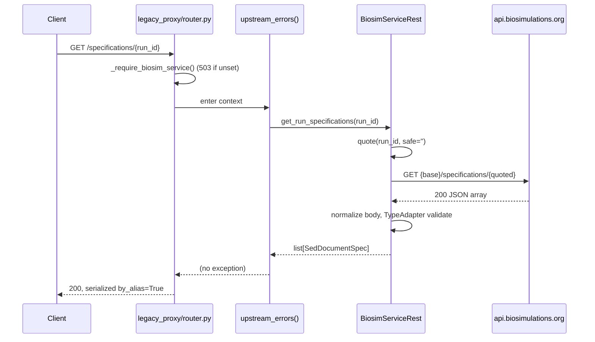
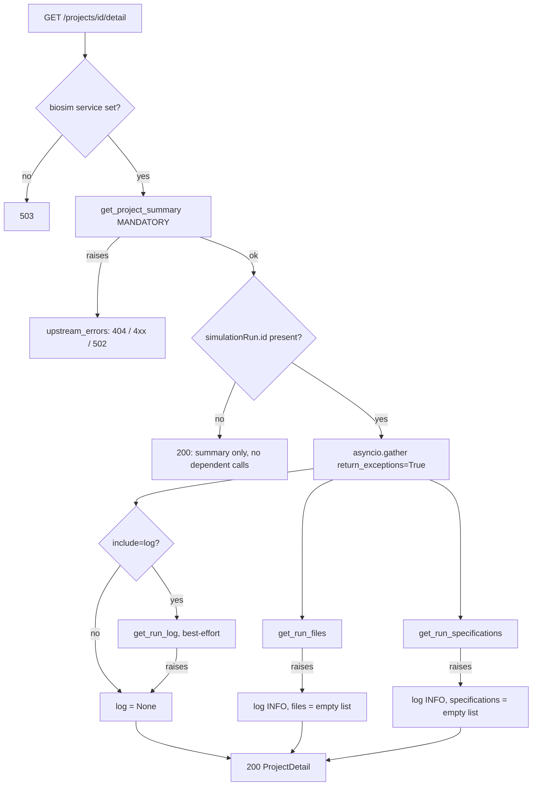

# Passthrough Implementation

Implementation record for the biosimulations.org passthrough proxy, built by
executing `docs/api_plan.md`.

- **Baseline commit:** `04b20d0` (`chore(.gitignore): update to include additional IDE and agent files`)
- **State:** all work is in the working tree; nothing has been committed.
- **Companion documents:** `docs/api_plan.md` (the design and its rationale),
  `docs/passthrough_api_tests.md` (the test guide).

---

## Overview

### The problem

`frontend/app/pages/projects/[id].vue`, `frontend/app/pages/runs/[id].vue`,
`frontend/app/composables/useVisualizations.ts` and
`frontend/app/components/LogAlgorithm.vue` read eight biosimulations.org
resources directly from the browser via `runtimeConfig.public.legacy_api_url`.
Only one of those — `GET /projects/{id}/summary` — had a platform route in front
of it, and its response model covered a small subset of the envelope.

### The goal of `api_plan.md`

Put the platform in front of the remaining seven resources with **typed** models,
without turning `ProjectSummary` into a mega-object. The plan's central rule:

> `ProjectSummary` remains a faithful typed mirror of `GET /projects/{id}/summary`.
> The other endpoints get endpoint-scoped sibling models and their own routes.

### Result

- A new model package, `backend/biosim_server/common/biosim_api/`, with one
  module per upstream endpoint family: 32 classes across 8 modules (30 public
  models plus the `UpstreamModel` base and one private output base).
- Six new client methods on `BiosimService` / `BiosimServiceRest`, plus one
  shared JSON-GET helper and one cached KISAO fetch.
- Six new passthrough routes in a new `backend/biosim_server/legacy_proxy/`
  router, at paths **wire-identical** to upstream.
- One optional aggregate route, `GET /projects/{id}/detail`.
- A shared upstream-error mapper replacing what would have been eight copies.
- 108 new tests (97 offline, 11 live), all passing, alongside 11 pre-existing
  project-summary tests that still pass unchanged; `ruff` and `mypy --strict` clean.

One latent defect in the pre-existing code was fixed along the way: a project
summary whose `simulationRun` lacked a `run` block raised `ValidationError`
inside the route, surfacing as an unhandled 500.

---

## Original Plan

`api_plan.md` §12 defines nine phases. Condensed:

| Phase | Requirement |
|---|---|
| 0 | Split the (then uncommitted) `common/json_types.py` into a `common/biosim_api/` package; drop the unused enums |
| 1 | Widen `ProjectSummary`: `created`/`updated`, run `id`/`name`/`submitted`/`updated`, `citations`/`encodes`, nested `SimulatorDetails`; make `run` optional |
| 2 | Extend `BiosimSimulationRun` with the simulator slug and version string; add `get_run_summary` + route; extract a shared error mapper |
| 3 | `ProjectFile` + `get_run_files` + route (bare JSON array) |
| 4 | The SED-ML models + `get_run_specifications` + route |
| 5 | `LogEntry` hierarchy + `get_run_log` + route, **without** retyping `get_sim_run_logs` |
| 6 | `OutputResults` + `get_output_results` + route, lazy and per-output |
| 7 | `KisaoTerm` + normalization + TTL cache + local fallback + route |
| 8 | Optional `ProjectDetail` aggregate |

Cross-cutting invariants from §7–§10 that shaped nearly every model:

- `extra="allow"` everywhere; every upstream field optional with a default.
- Lists default to `[]`; nested objects default to `None` (absence is meaningful).
- `str` over `StrEnum` for open passthrough vocabularies.
- Aliases must reproduce the upstream camelCase key exactly, in both directions.
- Semantic distinctions preserved: project `updated` ≠ run `updated`; run
  lifecycle `status` ≠ log status; `/runs/{id}.simulator` (slug) ≠
  `run.simulator.name` (display).
- `SimulationRunSummary` is shared between `/runs/{id}/summary` and the
  `simulationRun` member of a project summary, so the former is never called in
  project context.

---

## Implementation Summary

Architecturally, four things were added and one was fixed.

1. **A model layer that mirrors upstream rather than modelling a domain.** Every
   model in `biosim_api/` inherits `UpstreamModel`, which carries
   `ConfigDict(populate_by_name=True, extra="allow")` once so no model in the
   package can silently drop upstream keys.
2. **A client layer that centralises URL construction.**
   `BiosimServiceRest._get_biosim_json()` builds and issues every upstream GET;
   each public method supplies an already-quoted path.
3. **A route layer that is a thin, anonymous proxy.**
   `legacy_proxy/router.py` holds six routes, each delegating status mapping to
   `upstream_errors()`.
4. **An aggregate that composes, never mutates.** `ProjectDetail` holds a
   `ProjectSummary` alongside the run-scoped resources; `/projects/{id}/summary`
   is byte-for-byte unchanged.
5. **The `run`-required defect** in `ProjectSummarySimulationRun` was fixed
   (Phase 1).

---

## Files Changed

### Attribution note

Four of the eight modified files already had **uncommitted user work** in them
when this session began. The session-start `git status` listed exactly:

```
 M backend/biosim_server/biosim_runs/biosim_service.py
 M backend/biosim_server/projects/router.py
 M backend/tests/fixtures/biosim_service_mock.py
 M backend/tests/projects/test_project_summary.py
?? backend/biosim_server/common/json_types.py
?? docs/Biosimulations Platform Backend Study Guide.md
```

That pre-existing work typed `get_project_summary`'s return as `ProjectSummary`
(previously `dict[str, Any]`) and introduced `json_types.py`. `git diff` against
`04b20d0` therefore contains both that work and this implementation; the tables
below separate them.

### Added

| File | Change Type | Purpose |
|------|-------------|---------|
| `backend/biosim_server/common/biosim_api/__init__.py` | Added | Package exports (`__all__`, 34 names) |
| `backend/biosim_server/common/biosim_api/common.py` | Added | `UpstreamModel` base, `LabeledIdentifier`, `LogMessage` |
| `backend/biosim_server/common/biosim_api/projects.py` | Added | `ProjectSummary` |
| `backend/biosim_server/common/biosim_api/runs.py` | Added | `RunMetadata`, `SimulatorDetails`, `RunDetails`, `SimulationRunSummary` |
| `backend/biosim_server/common/biosim_api/files.py` | Added | `ProjectFile` |
| `backend/biosim_server/common/biosim_api/sedml.py` | Added | 14 public SED-ML models + a private `_SedOutputBase` + the `SedOutput` union |
| `backend/biosim_server/common/biosim_api/logs.py` | Added | `LogEntry` + 4 subclasses |
| `backend/biosim_server/common/biosim_api/results.py` | Added | `ResultDatum`, `OutputResults` |
| `backend/biosim_server/common/biosim_api/ontology.py` | Added | `KisaoTerm` + 4 KISAO id helpers |
| `backend/biosim_server/common/upstream_errors.py` | Added | `upstream_errors()` context manager |
| `backend/biosim_server/legacy_proxy/__init__.py` | Added | Re-exports `legacy_proxy_router` |
| `backend/biosim_server/legacy_proxy/router.py` | Added | Six passthrough routes |
| `backend/tests/legacy_proxy/upstream_stub.py` | Added | Shared `aiohttp` session stub |
| `backend/tests/legacy_proxy/test_run_summary.py` | Added | 13 cases |
| `backend/tests/legacy_proxy/test_files.py` | Added | 7 cases |
| `backend/tests/legacy_proxy/test_specifications.py` | Added | 22 cases |
| `backend/tests/legacy_proxy/test_logs.py` | Added | 11 cases |
| `backend/tests/legacy_proxy/test_results.py` | Added | 11 cases |
| `backend/tests/legacy_proxy/test_ontology.py` | Added | 13 cases |
| `backend/tests/legacy_proxy/test_live_upstream.py` | Added | 11 live cases, marked `integration` |
| `backend/tests/legacy_proxy/__init__.py` | Added | Package marker (empty) |
| `backend/tests/projects/test_project_detail.py` | Added | 16 cases for the aggregate |

### Deleted

| File | Change Type | Purpose |
|------|-------------|---------|
| `backend/biosim_server/common/json_types.py` | Deleted | Contents moved into `biosim_api/` (Phase 0). The file was **untracked**, so it does not appear in `git diff`. |

### Modified — clean at session start (wholly attributable to this work)

| File | Change Type | Purpose |
|------|-------------|---------|
| `backend/biosim_server/api/main.py` | Modified | Import and register `legacy_proxy_router` (2 lines) |
| `backend/biosim_server/biosim_runs/models.py` | Modified | `simulator_id`, `simulator_version_string` on `BiosimSimulationRun` (7 lines) |
| `backend/biosim_server/projects/models.py` | Modified | `ProjectDetail` + its imports (32 lines) |
| `backend/CLAUDE.md` | Modified | Eight rows added to the "Key API Endpoints" table |

### Modified — contains pre-existing work as well

| File | Change Type | This implementation's contribution |
|------|-------------|------------------------------------|
| `backend/biosim_server/biosim_runs/biosim_service.py` | Modified | 6 ABC methods, 6 REST implementations, `_get_biosim_json()`, `_fetch_kisao_term()`, two `TypeAdapter`s, the two new fields in `_sim_run_from_response()`, import path update |
| `backend/biosim_server/projects/router.py` | Modified | Error block replaced by `upstream_errors()`; `get_project_detail()` added; import path update |
| `backend/tests/fixtures/biosim_service_mock.py` | Modified | 6 mock implementations + 4 backing dicts and constructor parameters |
| `backend/tests/projects/test_project_summary.py` | Modified | Fixture widened; `_assert_parsed_summary` extended; 4 tests added incl. `_assert_subset` |

### Not attributable to this work

- `docs/Biosimulations Platform Backend Study Guide.md` — pre-existing untracked
  user document; not read into or modified by this implementation.
- `docs/api_plan.md`, `docs/passthrough_api_tests.md` — authored earlier in this
  session as design/test documentation, not as part of executing the plan. Only
  `api_plan.md`'s `**Status:**` line was edited afterwards to say "implemented".

---

## Detailed Implementation

### 1. The model package (Phases 0–1, 3–7)

`common/json_types.py` was split into `common/biosim_api/`, one module per
endpoint family. Three enums it carried — `ModelFormat`, `Simulator`,
`RunStatus` — were deleted. Evidence for removing them: a repo-wide grep found
no importers, and `RunStatus` duplicated
`biosim_server.biosim_runs.models.BiosimSimulationRunStatus`. `Simulator` also
carried a leading-space typo (`VirtualCell = " virtual cell"`).

Two model names changed in the move, because the old prefix became wrong once
the models served two endpoints:

| Old (`json_types.py`) | New (`biosim_api/runs.py`) |
|---|---|
| `ProjectSummaryMetadata` | `RunMetadata` |
| `ProjectSummaryRun` | `RunDetails` |
| `ProjectSummarySimulationRun` | `SimulationRunSummary` |

#### `common.py`

`UpstreamModel(BaseModel)` holds
`model_config = ConfigDict(populate_by_name=True, extra="allow")`. Every mirror
model inherits it. `LabeledIdentifier` (`{uri, label}`) serves creators,
keywords, citations and encodes. `LogMessage` (`type_` aliased `"type"`, plus
`message`) serves **both** `skipReason` and `exception` at all four log levels.

#### `projects.py` — `ProjectSummary`

```python
id: str
created: str | None = None
updated: str | None = None
simulation_run: SimulationRunSummary = Field(alias="simulationRun")
```

`created`/`updated` were previously untyped `extra` keys even though
`projects/[id].vue` renders them. `id` and `simulation_run` remain required —
unchanged from the pre-existing model, and the plan did not propose relaxing
them.

#### `runs.py` — the shared run summary

`SimulationRunSummary` gained `id`, `name`, `submitted`, `updated`. **`run`
became `RunDetails | None = None`**, which is the Phase 1 defect fix: it was
required, so a project without a `run` block raised inside the route, and
`get_project_summary()` catches only `ClientResponseError` and
`aiohttp.ClientError` — the `ValidationError` escaped as a 500.

`RunDetails` gained `simulator: SimulatorDetails | None`. `RunMetadata` gained
`citations` and `encodes`.

Timestamps are typed `str`, not `datetime`. This is load-bearing: upstream sends
JavaScript `Date.toString()` here — `'Sat Feb 05 2022 16:23:31 GMT+0000
(Coordinated Universal Time)'` — which `datetime` would reject. The observation
is pinned by `test_run_timestamps_are_not_iso_and_must_stay_strings`.

#### `files.py` — `ProjectFile`

All fields optional. `format` is a `str` holding a media-type URI, not an enum:
`useVisualizations.ts:33` substring-matches it (`.includes('vega')`), so the
vocabulary is demonstrably open.

#### `sedml.py` — the largest module

Three structural decisions:

**Serialized-or-expanded unions.** Upstream returns either an id string or the
expanded object for several references:

| Field | Type |
|---|---|
| `SedCurve.x_data_generator` / `.y_data_generator` | `str \| SedDataGeneratorRef \| None` |
| `SedCurve.style` | `str \| SedStyle \| None` |
| `SedStyle.base` | `str \| SedStyle \| None` (recursive; `SedStyle.model_rebuild()` follows the class) |
| `SedTaskSpec.model` | `str \| SedModelRef \| None` |
| `SedModelRef.language` | `str \| SedModelLanguage \| None` |

**A left-to-right output union, not a discriminated one.**

```python
SedOutput = Annotated[
    Union[SedReport, SedPlot2D, SedPlot3D, SedUnknownOutput],
    Field(union_mode="left_to_right"),
]
```

`SedReport`, `SedPlot2D` and `SedPlot3D` each declare a `Literal` `type_` aliased
`"_type"`, so they reject a mismatched tag immediately. `SedUnknownOutput` types
`type_` as a plain `str | None` and therefore accepts anything, which is why it
must stay last. A Pydantic `discriminator=` union was rejected because it raises
`union_tag_invalid` on an unrecognised tag — exactly the upstream change a proxy
must survive. `_SedOutputBase` (private) holds the shared `id`/`name`.

**`_type` must be aliased, never used as a field name.** A leading underscore is
Pydantic's private-attribute prefix, so the field is `type_` with
`Field(alias="_type")`.

`SedPlot3D.surfaces` is `list[Any]`: no 3D-plot sample has been observed, and
`extra="allow"` carries `zScale` through untyped.

#### `logs.py` — inheritance instead of repetition

`LogEntry(UpstreamModel)` holds `status`, `algorithm`, `output`, `skip_reason`
(alias `skipReason`), `exception`. Four subclasses add only what distinguishes
them:

| Class | Adds |
|---|---|
| `SedTaskLog` | `id` |
| `SedOutputLog` | `id`, `data_sets` (alias `dataSets`, typed `Any`) |
| `SedDocumentLog` | `location`, `tasks`, `outputs` |
| `RunLog` | `sed_documents` (alias `sedDocuments`) |

This collapses the plan's 33 requested log fields into 5 inherited definitions
plus 6 own ones. `status` is `str`: `SimulationLogs.vue:186` already maps
unrecognised values to a default colour, and these statuses describe *element
execution*, not the run lifecycle — a run can be `SUCCEEDED` while one task is
`SKIPPED`.

`data_sets` is deliberately untyped. Its shape is not specified in the plan's
field list, and the only consumer behaviour observed is a presence check
separating report logs from plot logs (`SimulationLogs.vue:162`).

#### `results.py`

`ResultDatum.values` is `list[Any]`, **not** `list[float]`. A repeated task
nests its results (the frontend flattens them in
`functions/sed-plot-2d-visualization.ts`), so the array is ragged and
arbitrarily deep; `list[float]` rejects real payloads.
`OutputResults.output_id` is aliased `outputId` and holds the composite
`"{sedDocLocation}/{outputId}"`.

#### `ontology.py`

`KisaoTerm` plus four module-level helpers:

| Function | Behaviour |
|---|---|
| `normalize_kisao_id()` | → colon form `KISAO:0000019` (keys `KISAO_TERMS`, OLS) |
| `upstream_kisao_id()` | → underscore form `KISAO_0000019` (the upstream path) |
| `kisao_ols_url()` | EBI OLS4 permalink using the colon form |
| `local_kisao_term()` | `KisaoTerm` from the vendored table, or `None` |

`local_kisao_term()` sets `description=None` because
`biosim_server/common/kisao_data.py` stores only `name` and `ancestors` —
verified by reading `backend/scripts/generate_kisao_data.py`, which fetches
`label` and `iri` and no definition.

Two other private normalizers exist in the repo and were deliberately left
alone: `compatibility.simulator_matcher._normalize_kisao_id()` also prefixes bare
numeric ids and rewrites every underscore (simulator matching depends on that,
and it would be wrong for a passthrough id), and `projects.search._kisao_name()`
is an inline lookup in the Mongo indexing path. The reasoning is recorded in
`ontology.py`'s module docstring.

### 2. The client layer

#### `_get_biosim_json()`

```python
async def _get_biosim_json(self, path: str, params: dict[str, str] | None = None) -> Any
```

Prepends `get_settings().biosimulations_api_base_url` and issues the GET. `path`
must arrive already percent-encoded. When `params is None` it calls
`session.get(url)` rather than `session.get(url, params=None)` — via a
`kwargs` dict — which keeps the pre-existing
`test_rest_client_requests_the_upstream_summary_url` assertion meaningful.

Every caller quotes its ids with `quote(..., safe='')`; there are seven such
path constructions and all seven are quoted.

#### New methods

| ABC / REST method | Upstream | Returns |
|---|---|---|
| `get_run_summary()` | `GET /runs/{id}/summary` | `SimulationRunSummary` |
| `get_run_files()` | `GET /files/{id}` | `list[ProjectFile]` |
| `get_run_specifications()` | `GET /specifications/{id}` | `list[SedDocumentSpec]` |
| `get_run_log()` | `GET /logs/{id}` | `RunLog` |
| `get_output_results()` | `GET /results/{id}/{outputId}?includeData=true` | `OutputResults` |
| `get_kisao_term()` | `GET /ontologies/KISAO/{id}` | `KisaoTerm` |

Array bodies are validated through module-level `TypeAdapter`s
(`_PROJECT_FILES_ADAPTER`, `_SED_DOCUMENTS_ADAPTER`) hoisted out of the request
path, since constructing one compiles a validator.

`get_run_files()` logs a warning and returns `[]` on a non-array body.
`get_run_specifications()` wraps a lone object into a one-element list and
returns `[]` for any other non-array body.

#### `get_sim_run_logs()` was not touched

It still returns `dict[str, Any]`. `simulations/router.py:364` passes that dict
straight into `JobLogs.logs`, so retyping it would have been a breaking change.
`get_run_log()` is additive.

#### KISAO caching and fallback

Split across two methods on purpose:

```python
async def get_kisao_term(self, kisao_id) -> KisaoTerm:      # public: fallback lives here
@cached(ttl=3600, cache=SimpleMemoryCache)                  # private: only successes cached
async def _fetch_kisao_term(self, upstream_id) -> KisaoTerm:
```

`get_kisao_term()` calls `_fetch_kisao_term(upstream_kisao_id(kisao_id))`,
catching `aiohttp.ClientError` (which covers `ClientResponseError`, so 404s
included). On failure it tries `local_kisao_term()`; if that is also `None` it
re-raises so the route maps to 404. Caching only the private method means a
degraded fallback is never pinned for the hour-long TTL.

The `ttl=3600, SimpleMemoryCache` choice follows the existing precedent on
`get_simulator_versions()`. Because the cache key is the normalized upstream id,
both spellings share one entry.

The awaited result is annotated (`term: KisaoTerm = await ...`) because
`aiocache`'s decorator is untyped and would otherwise widen to `Any` under
`mypy --strict`. That is a narrow annotation, not a suppression.

### 3. The route layer

`legacy_proxy/router.py` declares `APIRouter(tags=["Biosimulations passthrough"])`
with **no prefix**: paths are wire-identical to upstream so a frontend cutover is
a base-URL swap. `_require_biosim_service()` raises 503 when the global service
is unset.

| Route | `operation_id` | Response model |
|---|---|---|
| `GET /runs/{run_id}/summary` | `get-run-summary` | `SimulationRunSummary` |
| `GET /files/{run_id}` | `list-run-files` | `list[ProjectFile]` |
| `GET /specifications/{run_id}` | `get-run-specifications` | `list[SedDocumentSpec]` |
| `GET /logs/{run_id}` | `get-run-log` | `RunLog` |
| `GET /results/{run_id}/{output_id:path}` | `get-output-results` | `OutputResults` |
| `GET /ontologies/KISAO/{kisao_id}` | `get-kisao-term` | `KisaoTerm` |

`{output_id:path}` is required because a composite output id contains `/`; the
`:path` converter accepts both the literal and percent-encoded forms.

Verified via `app.openapi()` that the schema builds and all `operation_id`s are
unique, and via the route table that `/projects`, `/projects/stats`,
`/projects/reindex` and `/projects/{project_id}/summary` still resolve.

### 4. The shared error mapper

`common/upstream_errors.py` exposes one `@contextmanager`:

```python
upstream_errors(*, resource, identifier, not_found_detail, bad_request_subject)
```

| Upstream condition | Result |
|---|---|
| 404 | 404 with `not_found_detail` |
| other 4xx | forwarded verbatim, `f"Upstream rejected {bad_request_subject}: HTTP {status}"` |
| 5xx | 502, `f"Failed to fetch {resource}: HTTP {status}"`, logged |
| `aiohttp.ClientError` | 502, `f"Failed to fetch {resource} from the biosimulations.org API"`; the exception text (which names host and port) goes to the log only |

The parameterisation was chosen so the four message strings reproduce the
pre-existing `get_project_summary()` messages exactly, which is why its
error-mapping tests pass unchanged after the refactor.

### 5. `BiosimSimulationRun` extension

`_sim_run_from_response()` already read `res['simulator']` and
`res['simulatorVersion']` transiently to resolve a `BiosimulatorVersion`, then
discarded them. Two fields now persist them:

```python
simulator_id: Optional[str] = None              # e.g. "copasi"
simulator_version_string: Optional[str] = None  # e.g. "4.34.251"
```

The awkward name is deliberate: `simulator_version` on this model is already the
resolved `BiosimulatorVersion` **object**. The reason is recorded in a comment at
`biosim_runs/models.py`.

### 6. `ProjectDetail` (Phase 8)

`ProjectDetail` in `projects/models.py`:

```python
summary: ProjectSummary
files: list[ProjectFile] = Field(default_factory=list)
specifications: list[SedDocumentSpec] = Field(default_factory=list)
log: RunLog | None = None
```

`get_project_detail()` in `projects/router.py` accepts
`include: list[str] = Query(default=[])` and executes:

1. `get_project_summary()` inside `upstream_errors(...)` — **mandatory**.
2. `run_id = summary.simulation_run.id`. Falsy ⇒ return `ProjectDetail(summary=summary)`
   immediately; there is no key for a dependent request.
3. `asyncio.gather(get_run_files(run_id), get_run_specifications(run_id), return_exceptions=True)`.
   Each result is narrowed with `isinstance`; a `BaseException` is logged at INFO
   and the field degrades to `[]`.
4. `get_run_log(run_id)` only when `"log" in include`, wrapped in a bare
   `except Exception` — matching the existing best-effort pattern at
   `simulations/router.py:365`.

`get_run_summary()` is never called: the run summary is already embedded.
Results and KISAO terms are never fetched here.

---

## Passthrough Flow

### Simple passthrough (five of six routes)



Step by step:

1. **Entry.** FastAPI matches the route. Path params are plain `str`; only
   `output_id` uses the `:path` converter.
2. **Dependency check.** `_require_biosim_service()` → 503 if `get_biosim_service()`
   is `None`. No auth dependency: these routes are anonymous.
3. **Error scope.** `upstream_errors(...)` wraps the call.
4. **URL construction.** The client percent-encodes ids with `quote(..., safe='')`
   and hands an encoded path to `_get_biosim_json()`, which prepends the
   configured base URL and issues the GET. Only `/results` passes a query param
   (`includeData=true`).
5. **Upstream call.** A fresh `aiohttp.ClientSession` per call;
   `resp.raise_for_status()` converts non-2xx into `ClientResponseError`.
6. **Parsing.** `model_validate` / `TypeAdapter.validate_python`. `extra="allow"`
   retains unmodeled keys.
7. **Response.** FastAPI serializes the model with `by_alias=True`, reproducing
   the upstream camelCase keys plus any extras.
8. **Errors.** Mapped by `upstream_errors()` per the table above.

**Not forwarded upstream:** caller headers of any kind. Each client method takes
only ids, so there is no seam through which an `Authorization` header could
propagate. This is asserted by
`test_run_summary_route_is_anonymous_and_forwards_no_credentials` and
`test_project_summary_forwards_no_caller_credentials`.

### Aggregate flow — `GET /projects/{id}/detail`



Never reached from this route: `get_run_summary`, `get_output_results`,
`get_kisao_term`. All three are asserted `assert_not_awaited` in
`tests/projects/test_project_detail.py`.

---

## API / Interface Changes

### New HTTP endpoints (all additive, all anonymous)

| Method | Path | Response |
|---|---|---|
| GET | `/runs/{run_id}/summary` | `SimulationRunSummary` |
| GET | `/files/{run_id}` | `ProjectFile[]` |
| GET | `/specifications/{run_id}` | `SedDocumentSpec[]` |
| GET | `/logs/{run_id}` | `RunLog` |
| GET | `/results/{run_id}/{output_id}` | `OutputResults` |
| GET | `/ontologies/KISAO/{kisao_id}` | `KisaoTerm` |
| GET | `/projects/{project_id}/detail` | `ProjectDetail` |

`/projects/{project_id}/detail` accepts a repeatable `include` query parameter;
`log` is the only recognised value.

### Changed response shape

`GET /projects/{id}/summary` gains typed properties in its OpenAPI schema
(`created`, `updated`, `simulationRun.id/name/submitted/updated`,
`metadata[].citations`, `metadata[].encodes`, `run.simulator`). **The JSON body
is unchanged**: those keys were already emitted as `extra`, and each alias
reproduces the original key. `test_project_summary_roundtrip_preserves_upstream_wire_keys`
asserts every input key survives with the same name and value.

Two behavioural notes:

- Declared fields serialize before `extra` ones, so **key order changes**. No
  test asserts on ordering.
- A summary whose `simulationRun` has no `run` now returns 200 with
  `"run": null` instead of an unhandled 500.

### Internal interface changes

- `BiosimService` (ABC) gained six abstract methods. **Any third implementation
  outside this repo would break.** A repo-wide grep found exactly two:
  `BiosimServiceRest` and `tests/fixtures/biosim_service_mock.BiosimServiceMock`,
  both updated in the same change.
- `BiosimServiceMock.__init__` gained four optional keyword parameters
  (`run_summaries`, `run_files`, `run_specifications`, `output_results`), all
  defaulting to `None`. Existing call sites are unaffected.
- `BiosimSimulationRun` gained two optional fields; `simulator_version` is
  unchanged.
- `biosim_server.common.json_types` no longer exists. Its only importers were
  updated to `biosim_server.common.biosim_api`. As the module was untracked, no
  committed code referenced it.

### Configuration

**No changes.** No new environment variables, settings, or `config.py` entries.
The KISAO TTL is hard-coded at 3600s, matching the existing
`get_simulator_versions()` precedent.

---

## Error Handling and Edge Cases

### Upstream status mapping

Identical for all seven routes, via `upstream_errors()`: 404 → 404; other 4xx →
forwarded; 5xx → 502; transport failure → 502 with the upstream address stripped
from the body. `test_run_summary_route_maps_upstream_status` covers
404/400/403/500/503 parametrically;
`test_run_summary_route_transport_failure_hides_upstream_address` asserts neither
`"127.0.0.1"` nor `"Cannot connect"` appears in the response.

### Malformed and hostile input

- Every id is `quote(..., safe='')`-encoded, so `"../projects/secret?x=1"` stays
  one path segment. Each client test file has a quoting case.
- `output_id` is intentionally *not* fully opaque — its `/` is encoded as data,
  and the route's `:path` converter accepts both forms.

### Missing, null, and partial upstream data

| Condition | Behaviour |
|---|---|
| `simulationRun.run` absent | `run is None`; 200 |
| `metadata` absent or `[]` | `[]`; no placeholder element synthesized |
| `run.simulator` absent | `None`; not an empty `SimulatorDetails` |
| `style` / `style.line` / `style.marker` absent | `None` — absence drives renderer behaviour |
| `skipReason` / `exception` absent | `None`, meaning "not skipped" / "did not raise" |
| Empty `curves` / `dataSets` / `tasks` / `outputs` | `[]`, equivalent to absent |
| Unknown SED output `_type` | Falls through to `SedUnknownOutput` |
| Unknown log `status` or style `type` | Accepted as a plain string |
| `/files` non-array body | Warning logged; `[]` returned |
| `/specifications` lone object | Wrapped into a one-element list |
| `/specifications` other non-array | Warning logged; `[]` returned |
| Running simulation | Optionality alone covers it — no special-casing exists |
| Results not ready | Upstream 404 → 404 |
| KISAO upstream down, term known locally | Local `name` + OLS URL; `description=None` |
| KISAO unknown everywhere | Re-raised → 404 |

### Aggregate degradation

Only `get_project_summary()` can fail the request. `/files` and
`/specifications` failures degrade to `[]`; a `/logs` failure degrades to `None`.
All three failing at once still returns 200 with an intact summary
(`test_detail_tolerates_every_secondary_failing_at_once`).

### Not implemented

No retry, backoff, or timeout logic was added. Each call uses `aiohttp`'s
defaults, matching the pre-existing client methods.

---

## Tests and Verification

### Inventory

These nine files hold 119 cases. **108 are new in this work**; the other 11 are
the pre-existing `test_project_summary.py` cases, which pass unchanged.

| File | Cases | Focus |
|---|---|---|
| `tests/projects/test_project_summary.py` | 15 | Envelope typing, wire-key round trip, no-`run` regression, sparse metadata, shared-type proof |
| `tests/projects/test_project_detail.py` | 16 | Aggregation policy: mandatory vs. degrading vs. forbidden calls |
| `tests/legacy_proxy/test_run_summary.py` | 13 | Simulator id/version-string split, status mapping, anonymity |
| `tests/legacy_proxy/test_files.py` | 7 | Bare array, empty, null fields, non-array degradation |
| `tests/legacy_proxy/test_specifications.py` | 22 | Output union, unknown `_type`, recursive style, serialized/expanded unions, array handling |
| `tests/legacy_proxy/test_logs.py` | 11 | `LogEntry` inheritance, absence semantics, raw-log compatibility |
| `tests/legacy_proxy/test_results.py` | 11 | Nested values, slash-containing output id, `includeData` |
| `tests/legacy_proxy/test_ontology.py` | 13 | Id normalization, cache hit, local fallback, fallback not cached |
| `tests/legacy_proxy/test_live_upstream.py` | 11 | Live contract checks, marked `integration` |

Four of those 15 `test_project_summary.py` cases are new
(`..._roundtrip_preserves_upstream_wire_keys`, `..._without_run_object_parses`,
`..._tolerates_a_sparse_metadata_block`,
`test_embedded_simulation_run_is_the_shared_run_summary_type`); the other 11
pre-date this work and pass unchanged.

`tests/legacy_proxy/upstream_stub.py` provides `stub_session()` and
`upstream_error()`, shared by six test modules.

### Tests worth singling out

- `test_embedded_simulation_run_is_the_shared_run_summary_type` — validates the
  project summary's `simulationRun` sub-object as a standalone
  `SimulationRunSummary`. This is what licenses skipping `/runs/{id}/summary` in
  project context; if the shapes ever diverge, it fails first.
- `test_raw_get_sim_run_logs_still_returns_a_dict` — the compatibility guard for
  `GET /simulations/{id}/logs`.
- `test_unknown_output_type_falls_back_instead_of_raising` — pins the union
  design decision.
- `test_a_degraded_fallback_is_not_cached` — proves a local KISAO fallback does
  not pin itself for the TTL.
- `test_detail_without_a_run_id_skips_every_dependent_call` — no run id ⇒ no
  malformed upstream request.

### Verification actually performed

Run from `backend/`. All of the following were executed and produced the stated
result during this session; the figures below are from the final run:

| Command | Result |
|---|---|
| `uv run ruff check .` | `All checks passed!` |
| `uv run mypy biosim_server tests` | `Success: no issues found in 152 source files` (strict) |
| `uv run pytest -q -m "not integration"` | **419 passed, 15 skipped, 15 deselected, 0 errors** |
| `uv run pytest tests/legacy_proxy tests/projects -q -m "not integration"` | 144 passed, 11 deselected |
| `uv run pytest tests/legacy_proxy/test_live_upstream.py -m integration -q` | **11 passed** (live network) |
| `app.openapi()` + route-table inspection (ad-hoc) | Schema builds; `operation_id`s unique; existing `/projects/*` routes resolve |

Notes on the numbers:

- The 144-case subset includes pre-existing project-search tests, so it is not a
  count of this work's tests.
- Earlier in the session the same suite reported *358 passed, 61 errors*; those
  61 were `testcontainers` fixture failures because the Docker daemon was not
  running. Docker became available before the final run, and all 61 now pass —
  hence 419. None of them touch the passthrough.
- No `# type: ignore` was added beyond the repo's pre-existing `aiocache`
  pattern; one `mypy` `no-any-return` was resolved with an explicit annotation
  rather than a suppression.

### Recommended but not run

`docs/passthrough_api_tests.md` §6 lists unimplemented test recommendations. The
highest-value one: the live fixture project
(`Yeast-cell-cycle-Irons-J-Theor-Biol-2009`) contains three `SedReport`s, one SED
document and no styled curves, so `SedPlot2D`, `SedCurve`, `SedStyle`,
`SedLineStyle` and `SedMarkerStyle` have been validated **only against
hand-written fixtures**, never against live data.

---

## Deviations from `api_plan.md`

### 1. No `GET /runs/{id}` proxy route

**Plan:** §12 Phase 2 is titled "`/runs/{id}` and `/runs/{id}/summary`".
**Implemented:** the `/runs/{id}` work is the model extension only
(`simulator_id`, `simulator_version_string` on `BiosimSimulationRun`, populated
in `_sim_run_from_response()`); no route was added. Only `/runs/{id}/summary`
became a route.
**Reason:** Phase 2's own *Changes* and *Files/Symbols* sections list
`get_run_summary` as the sole new service method, and its test list refers to
"the route" in the singular. §3 also recommends extending `BiosimSimulationRun`
rather than adding a `RunRecord`. A `/runs/{id}` route would additionally have
had to choose between wire fidelity and the platform's own `BiosimSimulationRun`
shape — a decision the plan does not make.
**Impact:** the frontend's `/runs/{id}` call is not yet proxied. Adding it later
is purely additive.

### 2. `/specifications/{id}` returns an array

**Plan:** §3, §4 and §12 Phase 4 model a singular `SedDocumentSpec`; §15 Q2
flagged singular-vs-array as unresolved and provisionally recommended
normalising to the singular.
**Implemented:** `get_run_specifications()` and the route both return
`list[SedDocumentSpec]`; `ProjectDetail.specifications` is a list.
**Reason:** a live call to
`https://api.biosimulations.org/specifications/61fea483f499ccf25faafc4d`
returned a JSON array. The provisional singular shape silently discarded every
document after the first. Q2's stated verification method was exactly this
`curl`.
**Impact:** resolves Q2. A COMBINE archive with several SED-ML documents is now
represented correctly.

### 3. `SedTaskSpec.model` accepts a serialized id

**Plan:** §4 maps `tasks[].model.language.{acronym,name,sedmlUrn}`, implying an
inline object.
**Implemented:** `model: str | SedModelRef | None`, plus a new
`SedDocumentSpec.models: list[SedModelRef]`.
**Reason:** live data returns `"model": "model_wt"` — a bare id into a sibling
`models[]` array whose `language` is a bare URN string. The originally
implemented shape raised `ValidationError` on every real project, producing a
500. Discovered by running the live tests.
**Impact:** the endpoint works against real data. The expanded form still parses
(`test_task_model_may_be_expanded`).

### 4. `UpstreamModel` base class instead of a repeated `model_config`

**Plan:** §9 describes each model carrying
`ConfigDict(populate_by_name=True, extra="allow")`, following `json_types.py`.
**Implemented:** a shared `UpstreamModel` base.
**Reason:** identical behaviour across every model in the package, and it makes "a model that
forgot `extra="allow"`" — a failure mode the plan's own §14 self-review lists —
structurally impossible.
**Impact:** none behaviourally.

### 5. Pre-existing KISAO normalizers not consolidated

**Plan:** §7 and §16 call for normalization in one helper.
**Implemented:** one helper for the passthrough surface; the two pre-existing
private normalizers were left in place and documented.
**Reason:** `compatibility.simulator_matcher._normalize_kisao_id()` has
*different* semantics (it prefixes bare numeric ids and replaces every
underscore). Merging would change simulator-matching behaviour, which is outside
this plan's scope.
**Impact:** three normalizers exist repo-wide, but only one governs the
passthrough. The boundary is explained in `ontology.py`.

### Plan items implemented as specified

Phases 0, 1, 3, 5, 6, 7 and 8 were implemented as written. The §15 open questions
resolved by live evidence are Q1 (run summary *does* carry `submitted`/`updated`,
in a non-ISO format), Q2, Q3 (a log output's `dataSets` is `[{status, id}, …]`)
and Q5 (the vendored KISAO table genuinely has no descriptions, so the
proxy-with-fallback provisional stands).

---

## Remaining Work / Known Limitations

### Deferred by design

- **Streaming/binary endpoints are not proxied**: `/runs/{id}/download`,
  `/results/{id}/download`, `/files/{id}/{path}/download`, and the whole-run
  `/results/{id}`. They were never in the plan's scope. A frontend cutover must
  keep pointing these at the upstream host.
- **No platform ACL.** All routes are anonymous, matching the pre-existing
  `/projects/{id}/summary`. Private-run authorization is separate work, flagged
  in `api_plan.md` §15 Q7.
- **The frontend still calls `legacy_api_url` directly.** These routes have no
  production traffic yet.

### Open, with a permissive fallback in place

- `SedOutputLog.data_sets` is typed `Any`. One live sample shows
  `[{status, id}, …]`; that is not enough to commit to a schema (Q3).
- `SedPlot3D` has never been observed in live data; `surfaces` stays `list[Any]`
  (Q4).
- Result payload sizes are unmeasured, so whether `/results` should stream rather
  than buffer is unanswered (Q8).
- Upstream auth behaviour for private runs is unverified (Q7).

### Latent risk

`/results/{run_id}/{output_id:path}` **would match** `/results/{id}/download` and
treat `"download"` as an output id. If the streaming proxies are ever added they
must be registered *before* that route. Recorded in `legacy_proxy/router.py`'s
module docstring.

### Uncommitted

All work is in the working tree against `04b20d0`. Nothing has been committed or
pushed, and no release/deploy steps from `backend/CLAUDE.md` have been performed.

---

## Maintainer Notes

### Invariants that will break things quietly if violated

1. **An alias must reproduce the upstream key byte for byte.** Typing a field
   that previously rode through as `extra` changes nothing on the wire *only* if
   the alias matches. `test_project_summary_roundtrip_preserves_upstream_wire_keys`
   is the guard; extend its fixture when you add a field.
2. **`SedUnknownOutput` must stay last in `SedOutput`.** It accepts any object,
   so a left-to-right union reaches it only after the typed members reject the
   payload. Do not convert this union to `discriminator=`: that raises on an
   unknown `_type`.
3. **Never type an upstream timestamp as `datetime`.** Run summaries carry JS
   `Date.toString()` values.
4. **`ResultDatum.values` must stay `list[Any]`.** Repeated-task results are
   nested.
5. **Absence and emptiness differ.** For `style`, `line`, `marker`, `skipReason`
   and `exception`, `None` is meaningful to consumers; never default them to an
   empty instance.
6. **`get_sim_run_logs()` must keep returning `dict[str, Any]`.**
   `simulations/router.py` passes it straight into `JobLogs.logs`.
7. **`BiosimSimulationRun.simulator_version` is an object, not a string.** The
   upstream string lives in `simulator_version_string`.

### Coupling to know about

- **Adding a `BiosimService` abstract method breaks `BiosimServiceMock`.** Add the
  ABC declaration, the REST implementation and the mock implementation together
  or `mypy` and every test importing the mock will fail.
- **`ProjectSummary` and `SimulationRunSummary` are joined at
  `projects.py` → `runs.py`.** Changing `SimulationRunSummary` changes the
  project-summary response too — that sharing is the point, and it is what makes
  skipping `/runs/{id}/summary` legitimate.
- **Route ordering in `projects/router.py` matters.** `/projects/stats` and
  `/projects/reindex` are declared before `/{project_id}/summary` and
  `/{project_id}/detail`. `test_detail_route_does_not_shadow_stats_or_summary`
  guards this.

### Extension points

- **A new upstream endpoint:** add a module under `biosim_api/`, export it from
  `__init__.py`, add ABC + REST + mock methods together, then a route using
  `upstream_errors()`. Follow `files.py` as the smallest complete example.
- **A new field on an existing mirror:** optional with a default, aliased if
  camelCase, then extend the round-trip fixture.
- **Changing error mapping:** edit `upstream_errors()` once. The message strings
  are asserted by the project-summary tests, so changing them means updating
  those.

### Before merging any change under `biosim_api/`

Run the live tests — offline fixtures encode the shape the docs describe, not the
shape the API sends, which is precisely how the `tasks[].model` 500 was
introduced and then caught:

```bash
uv run pytest tests/legacy_proxy/test_live_upstream.py -m integration -v
```
