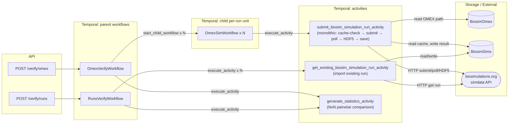
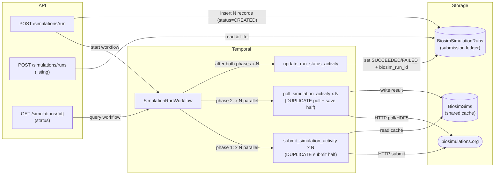
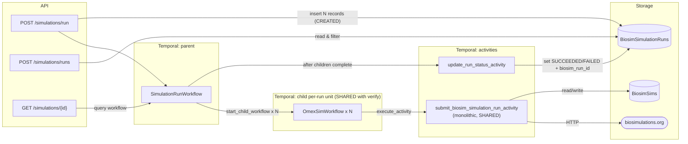
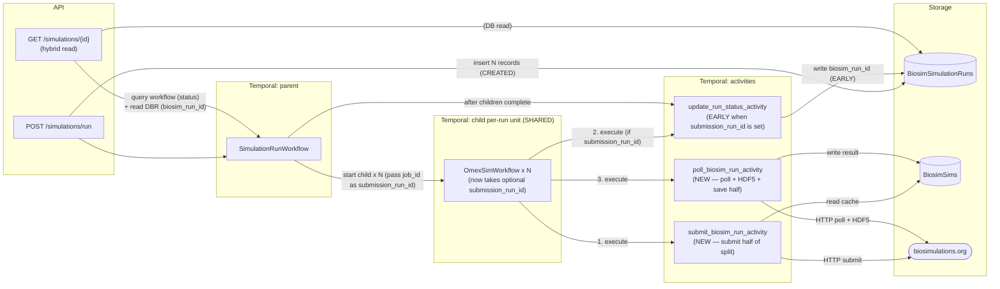
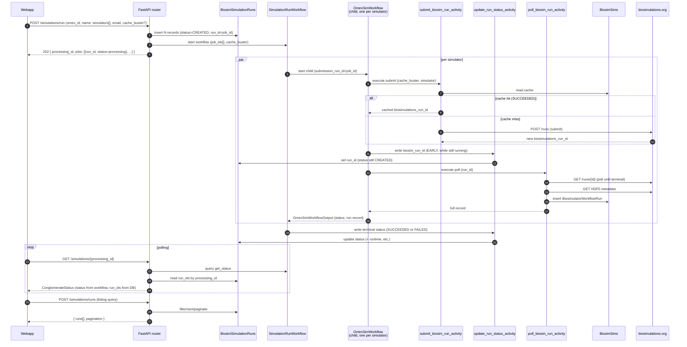
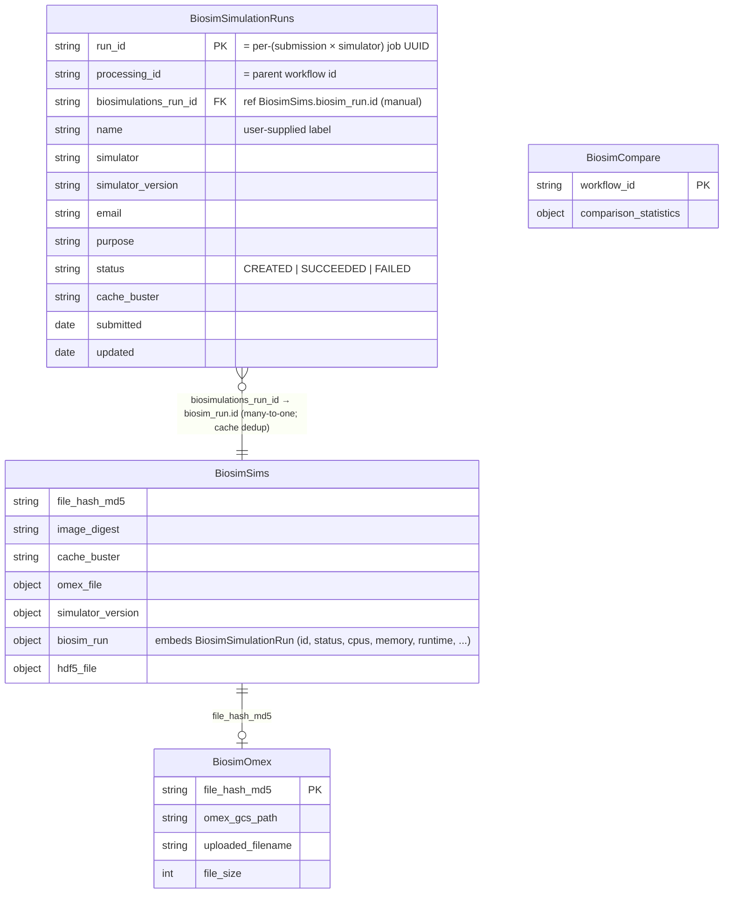
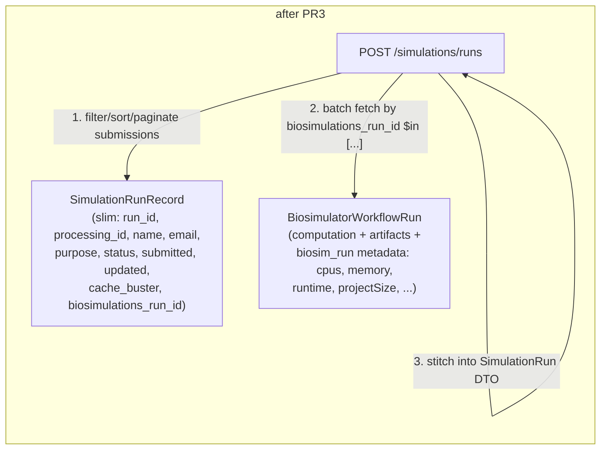

# Simulation Workflows & Activities — Architecture

A high-level design reference for the Temporal workflows and activities that
back the **verification** (`/verify/*`) and **simulation-run** (`/simulations/*`)
subsystems, including how they relate, what has changed during the run-listing
convergence work, and what's proposed next.

Companion docs:
- [`simulation-runs-api-plan.md`](simulation-runs-api-plan.md) — the original `/simulations/runs` plan.
- [`simulation-runs-convergence-plan.md`](simulation-runs-convergence-plan.md) — sequenced PR plan (PR0–PR3) and external-consumer TODO.

---

## Domain primitives

**Temporal model.** Workflows are deterministic, replayable orchestrators that
must do **no I/O** (no DB, no network, no clocks, no random). Activities are the
**side-effect boundary** — they own all I/O (HTTP, MongoDB, GCS, files, time).
Any database write in this system happens inside an activity.

**The per-run unit.** "Submit one OMEX archive to biosimulations.org for one
simulator, poll until terminal, fetch HDF5 metadata, and persist the result" is
the reusable unit. It is implemented today by **`OmexSimWorkflow`** (a child
workflow) backed by **`submit_biosim_simulation_run_activity`** (a monolithic
activity that bundles submit + poll + HDF5 + save). PR2 makes this unit shared
by both `OmexVerifyWorkflow` and `SimulationRunWorkflow`.

**Two storage entities for "a simulation":**
- `BiosimulatorWorkflowRun` (collection `BiosimSims`) — the **computation/artifact** record.
  Keyed by `(file_hash_md5, image_digest, cache_buster)`. Many submissions can
  map to one of these (cache deduplication).
- `SimulationRunRecord` (collection `BiosimSimulationRuns`) — the **submission ledger**.
  One per `(user submission × simulator)`. Carries user-facing identity (`name`,
  `email`, `purpose`, timestamps, display status) and a reference to the
  computation via `biosimulations_run_id`.

---

## Verification workflows (current state, unchanged by the convergence)

Two entry points, both producing pairwise NxN comparison statistics:

| Endpoint | Workflow | Per-run mechanism |
|---|---|---|
| `POST /verify/omex` | `OmexVerifyWorkflow` | starts N `OmexSimWorkflow` children (one per simulator) |
| `POST /verify/runs` | `RunsVerifyWorkflow` | imports N pre-existing biosimulations runs via `get_existing_biosim_simulation_run_activity` |

Key properties:
- `OmexSimWorkflow` (`biosim_runs/workflows.py`) is the **only place** that
  starts a fresh biosimulations.org run. It exposes a `@workflow.query` for its
  output but, today, the run_id is not populated on the queryable state until
  the monolithic activity returns at the end.
- `generate_statistics_activity` is shared by both verify workflows.
- `BiosimSims` is a **shared cache** — a workflow that finds a `SUCCEEDED`
  record for the same `(file_hash, image_digest, cache_buster)` reuses it
  instead of re-submitting.

---

## Simulation-run workflow — evolution

A user-facing path: the webapp submits an OMEX archive against one or more
simulators and later browses the runs in a table. This subsystem has gone
through three shapes; the convergence work is bringing it onto the verification
path's primitives.

### Shape A — original (pre-convergence)

`SimulationRunWorkflow` had its **own** submit/poll/save activity pair
(`submit_simulation_activity`, `poll_simulation_activity` in
`simulations/activities.py`) that duplicated the verify path's monolithic logic.

The duplication was the core liability: two implementations of the same logic
(cache lookup, HTTP submit, polling loop, HDF5-404 retry, BiosimulatorWorkflowRun
insertion) drifting against each other.

### Shape B — PR2 / [#51](https://github.com/biosimulations/platform/pull/51) (open)

`SimulationRunWorkflow` now runs each simulator via a child **`OmexSimWorkflow`** —
the same per-run unit the verify path uses. The duplicate
`submit_simulation_activity` / `poll_simulation_activity` are **deleted**. The
monolithic `submit_biosim_simulation_run_activity` becomes the single shared
implementation.

What changed and what didn't:
- ✅ One orchestration unit (`OmexSimWorkflow`) for both paths.
- ✅ Duplicate submit/poll activities deleted.
- ✅ **Verification production path entirely untouched** — PR2's diff is only
  `simulations/*`, `worker_main.py`, `temporal_fixtures.py`.
- ⚠️ `biosimulations_run_id` only surfaces in the live `GET /simulations/{id}`
  status when each child completes (the monolithic activity bundles submit +
  poll, so the workflow learns the run_id only at the end). The listing isn't
  affected — it gets the id at completion either way.

### Shape C — PR2.5 (activity split + early DB write) — **implemented**

The observation that motivates PR2.5: **activities are the canonical place to
write to a database in Temporal.** Once you split the monolithic activity, the
workflow has a moment between "I know the run_id" and "I'm done polling" — and
in that moment it can fire a small DB-write activity to record the run_id
**early**, persistently, in `SimulationRunRecord`. No child→parent signal
needed; just an activity doing what activities are for.

Key properties:
- `OmexSimWorkflowInput` gains an optional `submission_run_id` (= the per-job
  UUID = `SimulationRunRecord.run_id`). The verify path passes `None` →
  step 2 above is skipped → **zero behavior change to verification**.
- The status endpoint becomes a hybrid read: workflow query for live status,
  DB record for run_id (and any other submission metadata).
- The monolithic activity is replaced by the split pair; `OmexSimWorkflow`,
  `OmexVerifyWorkflow`, and `SimulationRunWorkflow` all benefit from the cleaner
  decomposition.

### Sequence — the run lifecycle after PR2.5

Steps 4–6 (the early DB write) and step 12 (hybrid status read) are the PR2.5
delta. Everything above the dashed band is in #51 today.

---

## Storage layer

Two intentional choices to call out:

1. **`BiosimSims` is a deduplicated *computation/artifact* table.** With caching
   on, many submissions of the same `(omex, simulator, cache_buster)` map to
   one `BiosimulatorWorkflowRun`. That's the result-provenance + cache role.
2. **`BiosimSimulationRuns` is the *submission ledger.*** One per user action,
   even on a cache hit. It carries identity (`email`, user-chosen `name`,
   `purpose`), submission timestamps, and a *display* status
   (`CREATED/SUCCEEDED/FAILED`) — three categories the listing UI actually uses.

In MongoDB the relationship is a **manual reference**, not a foreign-key
constraint (Mongo has no FKs). Orphans (a submission with no completed
computation yet) are normal mid-flight states — an app-side left join yields
`null` computed fields and the row renders as "still running."

---

## PR3 preview — normalize the submission ledger

PR3 will slim `SimulationRunRecord` to submission-owned fields plus the
`biosimulations_run_id` FK, and have the listing **app-side join** to
`BiosimulatorWorkflowRun` for computed/derived fields (digest, cpus, sizes,
runtime, …). The current denormalization (copying those columns onto every
submission row and writing them back via `update_run_status_activity`) is the
real "two-table awkwardness" — the *existence* of two tables is correct; the
*duplicated columns* are the smell.

The frontend's filterable/sortable columns are all submission-owned, so the
listing UX needs no DB-side joins — a clean two-query app-side join is enough.

---

## Deploy considerations

PR2.5 restructures the per-run activity sequence inside `OmexSimWorkflow`: one
monolithic `submit_biosim_simulation_run_activity` became two activities
(`submit_biosim_run_activity` + `poll_biosim_run_activity`), with an optional
third (`update_run_status_activity`) in between when the run path passes a
`submission_run_id`. The number and names of `ScheduleActivityTask` commands
the workflow issues at each step have changed.

Temporal replays workflow code against recorded history when a worker restarts
or shifts a workflow to a new sticky-task-queue host. If a worker running the
**new** code replays a workflow whose history was recorded under the **old**
monolithic activity, the command sequence at index 0 won't match
(`submit_biosim_simulation_run_activity` in history vs `submit_biosim_run_activity`
in the new code) and the worker raises
`NonDeterministicWorkflowError`. The mismatch isn't repairable by an
`@activity.defn(name=…)` alias alone — the *number* of scheduled activities
also differs.

**Required deploy procedure for PR2.5 and later "Shape C" releases:**

1. **Drain in-flight workflows before rolling out workers with the new code.**
   Wait for active `OmexSimWorkflow` / `OmexVerifyWorkflow` / `SimulationRunWorkflow`
   instances to complete, or terminate them with `tctl workflow terminate`. The
   biosim platform's typical workflow takes 5–20 minutes; a brief drain window
   suffices.
2. Deploy the new `platform-worker` image once the namespace is quiet.
3. The `platform-api` image is safe to deploy at any time — its only Temporal
   contract is `start_workflow` / `query_workflow`, both of which remain shape-
   compatible.

**The longer-term safe-rollout pattern** (deferred — adds significant
maintenance cost for a one-time transition) is to wrap each restructure in
`workflow.patched("…")`, keep the old code path live until all pre-deploy
histories are drained, then remove the patch. Worth doing if future workflow
restructures are anticipated; not worth doing for PR2.5 alone.

**Replay safety nets that the PR2.5 code already provides:**
- `SimulationRunWorkflow.run` reads `output.biosimulations_run_id` *and* falls
  back to `output.biosimulator_workflow_run.biosim_run.id` for child outputs
  serialized before the PR2.5 field was added — so an in-flight parent whose
  children completed under the old code still records the external run id on
  replay.
- `update_run_status_activity` is a no-op when its DB service is None and is
  idempotent on replay (`update_one` matches by `run_id` and `None` fields are
  skipped), so re-execution from history doesn't corrupt the submission ledger.

## Open items

- **biosim-client impact analysis.** The Python client at
  `../biosim-client` (https://github.com/biosimulations/biosim-client) is an
  external consumer of this platform's API surface and may be affected by
  PR1's `BiosimSimulationRun` additions and PR3's listing reshape. Inventory →
  diff → versioning/contract → consider monorepo absorption. See the TODO
  section in [`simulation-runs-convergence-plan.md`](simulation-runs-convergence-plan.md);
  do the inventory before PR3 lands.
- **No real auth.** Owner-scoped queries (`type=user` + `user=<email>`) trust
  the supplied email today. Out of scope for the convergence work; flagged so
  it doesn't get lost.

### Known issues from the PR #52 code review

The high-severity findings (worker pod disk leak, FAILED-row cache pollution,
missing Mongo indexes, status 404 after Temporal eviction) shipped in PR #53.
These remain open — each has a tight fix; tackle them when convenient, or
when one starts firing in production.

#### Medium — fires under specific conditions

- **#13 — Initial `get_sim_run` in `poll_biosim_run_activity` has no 404 handling.**
  *Trigger:* biosimulations.org is eventually consistent; the Temporal task-queue
  hop between submit and poll can land inside the consistency window.
  *Impact:* A run biosimulations.org actually accepted hits 404 on the first
  poll-side GET → activity raises → with `maximum_attempts=1` the whole run
  is lost. New hazard introduced by the submit/poll split in PR #52 (the
  monolithic activity reused the in-hand `simulation_run` and never made this
  call).
  *Fix:* short retry loop around the first `get_sim_run` on `ClientResponseError(404)`,
  or a brief `workflow.sleep` before scheduling poll.

- **#8 — `_submit` activity timeout reduced from 20 min to 5 min.** *Trigger:*
  large OMEX archives over slow / contended uplinks. *Impact:* hard-fail on a
  single slow upload with `maximum_attempts=1` and no retry — user has to
  resubmit. Risk scales with OMEX size distribution. *Fix:* bump
  `start_to_close_timeout` for `submit_biosim_run_activity`, or split GCS
  download from biosimulations.org upload into two activities so each gets
  its own budget.

- **#6 — HDF5 retry last attempt re-raises 404 (off-by-one).** *Trigger:*
  `simdata` API lag persists past the 10-retry window (~100 s) for a SUCCEEDED
  run. *Impact:* poll activity raises → no `BiosimulatorWorkflowRun` saved →
  next submission re-runs the simulator from scratch (no cache row). Pre-existing,
  but the PR #52 split makes the wasted submit work more visible. *Fix:* on
  the final attempt, log + record `hdf5_file=None` instead of re-raising; the
  workflow still surfaces SUCCEEDED with degraded artifact metadata.

#### Lower — rare or contained

- **#7 — Cache hit returns `cached.workflow_id` verbatim.** Audit/traceability
  confusion: a `BiosimulatorWorkflowRun` from a cache hit points at the prior
  submission's workflow id, not the current one. Not user-visible. *Fix:* add
  an explicit `is_cache_hit: bool` field on `BiosimulatorWorkflowRun` (or a
  separate `cache_lookups` collection) so the original `workflow_id` is
  preserved and reuse is observable.

- **#15 — `update_simulation_run` always bumps `updated`.** Temporal replay of
  `OmexSimWorkflow` can fire the early `update_run_status_activity` again with
  the same `biosimulations_run_id` — every replay bumps `updated` even though
  no field actually changes. Minor data noise; muddies any future "sort by
  updated" UI. *Fix:* if the proposed `$set` would contain only `updated`,
  skip the update.

- **#11 — Lazy `ImportError` not caught by `except ActivityError`.** The lazy
  `from biosim_server.simulations.activities import …` inside `OmexSimWorkflow.run`
  isn't covered by the surrounding `except ActivityError`. A worker image that
  excludes the `simulations` package (none today, but plausible if a verify-only
  worker ever emerges) would abort the workflow on a path documented as
  "non-fatal." *Fix:* widen the `except`, or pull the import to module top
  (the cycle the lazy import guards against has since been re-evaluated — see
  the simplify discussion in PR #52).

- **#12 — `asyncio.gather(*, return_exceptions=True)` captures `CancelledError`.**
  Operator-initiated cancellation of `SimulationRunWorkflow` (via `tctl workflow
  cancel`) is mapped to `status="failure"` with an empty `error` and recorded
  as FAILED in `SimulationRunRecord`. Affects manual ops only. *Fix:* re-raise
  on `CancelledError` so cancellation propagates and the run is recorded as
  cancelled (would also need a `CANCELLED` display status, or just no terminal
  update).

- **#9 — `get_simulation_runs_by_processing_id` caps at `length=100`.**
  Submissions with >100 simulators silently lose enrichment past job 100.
  Cap is well above any realistic submission today. *Fix:* `length=None` (or
  match the workflow's job count exactly).
